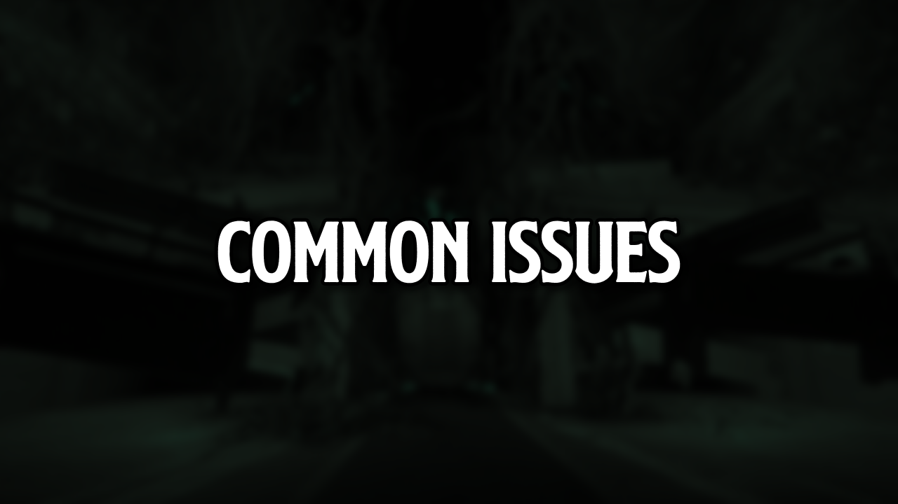
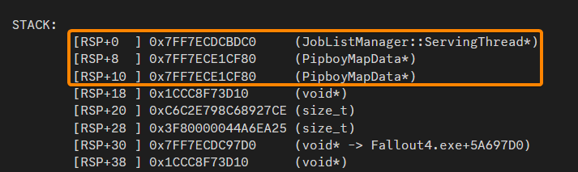

[ <a href="https://github.com/iAmMe27/WoD/blob/main/README.md">Getting Started</a> ]
[ <a href="https://github.com/iAmMe27/WoD/blob/main/Installation.md">Installation</a> ]
[ <a href="https://github.com/iAmMe27/WoD/blob/main/PostInstall.md">After Install</a> ]
[ <a href="https://github.com/iAmMe27/WoD/blob/main/ModSetup.md">Mod Setup</a> ]
[ <a href="https://github.com/iAmMe27/WoD/blob/main/Controls.md">Controls</a> ]
[ Common Issues ] 

&nbsp;

## Contents
- [Contents](#contents)
- [Preface](#preface)
- [Download Issues](#download-issues)
  - [Missing files](#missing-files)
  - [Commonly Failing Downloads](#commonly-failing-downloads)
  - [Nexus Login Expired](#nexus-login-expired)
  - [Nexus Server Issue](#nexus-server-issue)
  - [Incorrect Game Files](#incorrect-game-files)
  - [File/Mod not Available](#filemod-not-available)
- [Installation Issues](#installation-issues)
  - [Could not find part of the path](#could-not-find-part-of-the-path)
- [Game Crashes](#game-crashes)
  - [Common Crashes](#common-crashes)
    - [1. Overlay Software](#1-overlay-software)
    - [2. Rusty Face Fix](#2-rusty-face-fix)
    - [3. Equip Crash](#3-equip-crash)
    - [4. You disabled Volumetric Lighting](#4-you-disabled-volumetric-lighting)
    - [5. Crash caused by `XAudio2_7.dll`](#5-crash-caused-by-xaudio2_7dll)
- [Other Post-Install Issues](#other-post-install-issues)
  - [Blurry Textures](#blurry-textures)
  - [I can't move my mouse cursor around the whole area of my screen](#i-cant-move-my-mouse-cursor-around-the-whole-area-of-my-screen)
  - [My game performance sucks!](#my-game-performance-sucks)
- [Gameplay Issues](#gameplay-issues)
  - [Controls](#controls)
    - [VATS doesn't work](#vats-doesnt-work)
  - [User Interface](#user-interface)
    - [I want my my ammo counter back!](#i-want-my-ammo-counter-back)
    - [I want my 3rd person crosshair back!](#i-want-my-3rd-person-crosshair-back)
  - [Quests](#quests)
    - [Nick Valentine won't talk to me about a missing child!](#nick-valentine-wont-talk-to-me-about-a-missing-child)

## Preface
Please help me to help yourself here. Search this page and the [FAQ](FAQ.md) if you are having issues. Please also use the Discord search function in the WoD channels as your issue may already be solved. Do not just post a question in the support channel without doing your own research first.

## Download Issues

>[!CAUTION]
> If wabbajack throws an error, **DO NOT CLICK THE RETRY BUTTON**.  
Clicking the retry button will delete already downloaded mods and cause them to be downladed again, wasting your time.  
> 
> Instead, read carefully what kind of problem Wabbajack encountered, close Wabbajack, fix the error and then start the wabbajack installation again.

If you are not able to fix your Wabbajack error, or it is not listed in this list, please ask for support in our discord. Link is on the [first page](README.md) of this guide.

### Missing files
If you encounter an error looking like this:  

  
Click the "Show Missing Archives" button.  
A browser windows will open, showing the **EXACT NAMES** of the file you need to download, and a link to each file. Make sure you downloaded the correct file and the filenames match. Put the downloaded files in the Wabbajack downloads folder and start Wabbajack again.

### Commonly Failing Downloads
It's one of the files on the commonly failing downloads list. Wabbajack even gives you report now, please read that to know exactly what files you missed. [All commonly failing downloads can be found on the Wiki page here.](https://github.com/iAmMe27/WoD/wiki)

### Nexus Login Expired
Your Nexus login expired. In the Wabbajack settings, log out of Nexus and then re-login.

### Nexus Server Issue
The Nexus server you are downloading from is having issues, try switching your preferred Nexus download server to something close to your location in the account settings. You can access this area by clicking on your account in the top right, and selecting site preferences.

### Incorrect Game Files
Your game files are wrong - this will give a clear error in the Wabbajack log, like so:

To fix this, you need to ensure your game is set to English in Steam and then verify your game files with Steam.

### File/Mod not Available
You'll need to wait for a modlist update.

## Installation Issues
1. Hashes don't match for texture files (files that end in `.DDS`) - Your Wabbajack version is outdated, make sure you are using v3.7.0.0 or later.

2. File is corrupt (usually `.ba2` files) - Wabbajack will tell you what file the error is with in its log as well as to delete it and retry the install. Follow the steps given to you by Wabbajack.

3. Your storage drives are full - both the installation drive and the drive you have Wabbajack on need a free space for the installation to be possible.

4. You didn't setup antivirus exclusions.

### Could not find part of the path
If you encounter an error looking like this:  

Do the following:
1. Close Wabbajack.
2. Go to your install folder and locate the `TEMP_BSA_FILES folder`, if it exists.
3. Empty that folder.
4. Restart Wabbajack.
5. Restart Modlist installation.

## Game Crashes
Heavily modded Bethesda games are prone to crashing at times. We follow the general crash rules:

* 1 crash is a fluke, 
* 2 crashes is weird but not impossible, 
* 3 is a repeatable crash worth reporting and/or investigating.

Before you report a crash, consider these rules and also read below to see if your issue is already known about.

### Common Crashes

#### 1. Overlay Software
Software such as **Medal**, **EVGA Precision** and **MSI Afterburner** are the most common causes of this - anything that hooks the display to show or record stuff on screen. Close the software and test again.

#### 2. Rusty Face Fix
This shows up in crash logs with the following things in the stack: `hclClothInstance`, `hclClothData` and hair parts named, like so:

The crashes are random and seem to appear more often in areas where lower end PC's performance suffers, which will be different between different PC's. You can turn the active portion of Rusty Face Fix Redux off by opening the INI found in `Rusty Face Fix - WoD INI` and setting the `streaming_mode` to 0. If there is a version of these settings named `Rusty Face Fix - iAm’s Settings` enabled, disable it. *Note: with the active portion switched off, you may see more rust face NPCs as you play.*

#### 3. Equip Crash
This shows up in crash logs with the following things in the stack: `JobListManager::ServingThread` and `PipBoyMapData`, like so:

This is a very rare crash that WoD has custom mitigations against. To fix, type the following commands into the console:

`player.unequipall`

Followed by:

`player.equipitem 21b3b`

#### 4. You disabled Volumetric Lighting
This crash occurs when you enter workshop mode. Do not touch the `Disable Volumetric Lightning` in NAC X Settings menu/MCM. It will make the game crash every time you enter workshop mode and it **can't** be reverted - you will have to load an earlier save to fix it.

#### 5. Crash caused by `XAudio2_7.dll`
Make sure your WoD folder is added to your antivirus exclusions. If it is, [download Microsoft Redist (June 2010) from here.](https://www.microsoft.com/en-us/download/details.aspx?id=8109)
We have also found that this crash can be caused by some headsets/headphones, especially Bluetooth ones. We don't know why, only that it does crash and swapping to a different audio output device stops it.

## Other Post-Install Issues

### Blurry Textures
The low resolution textures you are seeing after playing for a time is caused by Long Loading Times Fix.

This mod aims to reduce loading times, especially when fast travelling or travelling through loading screens but can sometimes remove the loading screen a touch too early, before textures have fully loaded in.

If this behaviour bothers you, it should be safe to switch off mid-save.

> [!TIP]
> This mod is disabled by default in WoD and needs to be manually enabled to work.

### I can't move my mouse cursor around the whole area of my screen
This is caused by Windows scaling. To fix this, navigate to your WoD install folder and then find `Stock Game\Fallout4.exe`, right click on the exe, go to the `Compatibility` tab, click the `Change high DPI settings`, tick the `High DPI scaling override` and change the dropdown option to `Application`.

### My game performance sucks!
This could be caused by a few things:
  1. You didn't setup a Pagefile as described earlier in this readme or,
  2. You didn't install on an SSD or,
  3. Your hardware doesn't meet the minimum recommended specs.

If you genuinely have followed the above steps then ensure the following:
  1. When setting the pagefile up, ensure you have enough space left on the selected SSD for Windows to allocate the full pagefile size - not having the 20 to 40GB free on the SSD is the same as not having a big enough pagefile in the first place.
  2. You have added your entire WoD installation folder to your antivirus exceptions/allow list - you want the whole folder, not just the Mod Organizer exe.
  3. You have your motherboards XMP/DOCP/EXPO setting switch on - without this setting on, your RAM will be running at the default 2400MHz standard, not the speed you paid for. Enabling this will give a good boost in performance across everything you do but especially games. Of course, not all RAM is capable of clocking higher than the standard 2400MHz but most "gaming" prebuilts and "gaming" level RAM should clock higher if allowed.

*Note: if you did buy a prebuilt PC, the XMP setting is worth a double check - not all system builders enable this setting before shipping you your PC for some reason.*

If you have ensured all of the above is right, try lowering settings in BethINI, [following this guide in the modifications channel on the Discord.](https://discord.com/channels/719714673431150627/1095988679463424000/1096709202052915250)

## Gameplay

### Can I play the vanilla intro?
No. It sucks and the game has been out since 2015. If you haven't played it by now, there are other ways to play it.

### Automatron DLC is not starting
WoD uses [Integrated Automatron](https://www.nexusmods.com/fallout4/mods/85317).

It imposes some delays and requirements before the quest starts. For more information, read the mod page linked above.

### Where are all the crafting recipes?
I know all the mod pages say that they're in the Chem Station or whatever, but not in WoD. In WoD, they are all moved to the appropriate work station in the Universal Workbench. You can follow the quest to grab a portable one by the entrance of Vault 111 or build static ones from the settlement build menu.

### How do I acquire *volunteers* for my settlements?
You need to craft a couple things at the Universal Workbench:

1. The Baton - find it in the `Weapon - Create` menu > Human Resources,
2. A Kit - find it in the `Utility Station` menu > Human Resources.

When an enemy gives up in combat, hit them with the baton to get started. Take them back to your settlement and then process them using the Human Resources terminal.

### How do I cure trauma or reset attributes?
See the nurse in the memory den.

### How do I cure my addiction to creature *secretions*?
See the lady hiding in Goodneighbour. She usually hides above the stores.

### Interior cells are too dark
Use your flashlight :^)

*Or*

You can enable `Interior Lighting Overhaul` in NAC.X.
Open MCM -> NACX -> Settings and enable the setting.
Below is a comparison between off and on.

> [!TIP]
> If the setting seemingly does nothing, make a full save, quit to main menu and reload the save.
> This seems to happen if you start building lights in an interior cell, without reloading the cell, the setting doesn't always work.

### I'm getting too many perk points per level
*Oh no, my steak is too juicy and my lobster is too buttery!*

You can adjust how many perk points per level you get, if you wish.

In MO2, search for `pppl` (see below screenshot), right click on it and select "Open in Explorer".
Then navigate through the folder structure, F4SE -> Plugins.
There you will find the `pppl.ini` file.
In the green text at the top of the file you'll find a manual about how the file works.

If you just want the default (1 perk point per level), just put `2=1` and delete the reset (see screenshot below).
Save the file and close the explorer window.

> [!WARNING]
> If you edit of the the files included in the modlist, you should ask for support in the `#wod-modified` channel in Discord, as this is now a modified list.

### Camera stuck in character creation
If the camera is stuck behind Nate and Nora during character creation in the bathroom scene:
- Choose your desired gender
- Accept the default look
- Continue the guide until you are in the Commonwealth and have done your [Mod Setup](ModSetup.md)
- Go in 3rd person mode and turn the camera so you can see your character
- Open the console and type: `slm 14`
- Looks Menu for your character will now open and you can change the looks to whatever you want

### Controls

#### VATS doesn't work
We don't use VATS, we use VAFS - consider it like bullet time. If it won't trigger, set the VATS keybind in the Settings menu to something else.

### User Interface

#### I want my ammo counter back!
This is deliberately hidden on profile 3 in preference to another mod that provides ammo checking functionality. If you are not on profile 3 but the ammo counter is not visible, you can make it visible again by following the below steps:
  1. Head to the `Fall UI - HUD` MCM
  2. Click the part of the UI you want to see in the window on the right (ammo or grenade count)
  3. Click the `Show/Hide` button in the overlay menu.

You will likely have to save and load your game again to refresh the UI and make the change appear.

#### I want my 3rd person crosshair back!
This is deliberately hidden on profile 3. If you are not on profile 3 but want the 3rd person crosshair, check the following:
  1. Check your chosen HUD layout in the `FallUI - HUD` MCM to make sure that the crosshair is not disabled there
  2. Check the `Immersive HUD` MCM and set your crosshair settings according the below image.
  3. Check the vanilla game settings.

*Note: some scope options deliberately hide the 3rd person crosshair!*

You will likely have to save and load your game again to refresh the UI and make the change appear.

### Quests

#### Nick Valentine won't talk to me about a missing child!
You forgot to investigate Vault 111 first. You have to do this in order to kickstart the main quest.

## Additions

> [!WARNING]
> **None of the additions here are officially supported but this information is provided here for easy reference.**

### I added Ivy, but she has no face
This is a known issue, we are not sure yet what causes it.  

To fix it, do the following:
- Open the console and click on Ivy
- At the top of the console there should now be Ivy's name and her RefID (in brackets)
- Type in the console: slm RefID (for example: slm A6003491)
- With Ivy's LooksMenu open, change her Hairstyle to something else, and change it back
- Ivy's head should now be visible

> [!TIP]
> If the solution above does not work for you, you can install the [Wasteland Wonderglue Ivy Patch](https://www.nexusmods.com/fallout4/mods/86384?tab=files).  
>  
> Be aware that doing so is modifying your WoD install. Please ask your support questions in wod-support if you modfied your install.

