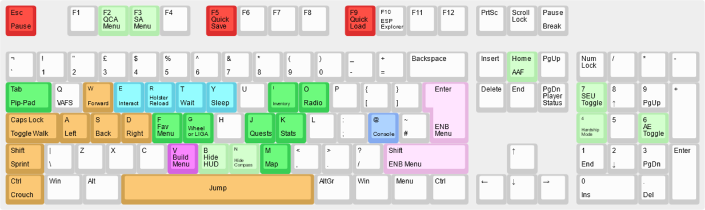

[ <a href="https://github.com/iAmMe27/WoD/blob/readme-testing/README.md">Getting Started</a> ]
[ <a href="https://github.com/iAmMe27/WoD/blob/readme-testing/Installation.md">Installation</a> ]
[ <a href="https://github.com/iAmMe27/WoD/blob/readme-testing/PostInstall.md">After Install</a> ]
[ <a href="https://github.com/iAmMe27/WoD/blob/readme-testing/ModSetup.md">Mod Setup</a> ]
[ Controls ]
[ <a href="https://github.com/iAmMe27/WoD/blob/readme-testing/CommonIssues.md">Common Issues</a> ] 

&nbsp;

## Rotating the PC in LooksMenu
We have a mod for that.

- Right Mouse Button enables rotation;
- Middle Mouse Button enables movement of the character up, down, left and right;
- Shift + Mouse Wheel to zoom in and out.