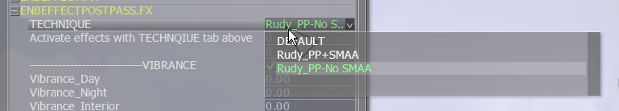

# Enabling DLAA
As of the v0.9 Preview Build 7.3, WoD has shipped with the FO4 Upscaler in DLAA mode. With this enabled and  the game's TAA and ENB SMAA switched off, it gives the game a better overall look in general as textures look more crisp and edges look smoother without that signature *vaseline smeared over your eyeballs* blur that TAA gives you.

DLAA is compatible with ENB, so there's no need to purchase the Patreon version of the Upscaler to use DLAA. You only need the Patreon version if you want to use DLSS/FSR/XeSS.

DLAA is only supported by Nvidia RTX type GPU's, so anyone with an AMD or non-RTX Nvidia GPU won't be able to use this and DLAA is also not compatible with:
- Nvidia Reflex
- DXVK

 If you want to enable DLAA, you need to turn both the games' TAA off and ENB's SMAA. To do this:

1. In MO2, open the `Upscaler` tab and enable the `Fallout 4 Upscaler` and the `DLAA` mods. Then click the puzzle piece icon at the top and click `INI Editor`:

 

2. In the window that opens, swap to `Fallout4Prefs.ini` and find the line `sAntiAliasing = TAA` and change to the following:

`sAntialiasing =` (remove the TAA part).

3. Click save.

To disable ENB AA, run the game and open the ENB menu with Shift+Enter. Open the `ENBEFFECTPOSTPASS.FX` dropdown in the right side menu and change the `Technique` option to one with no AA, like so:

Click Save in the top left of the ENB window and close the menu.

Donezo!
