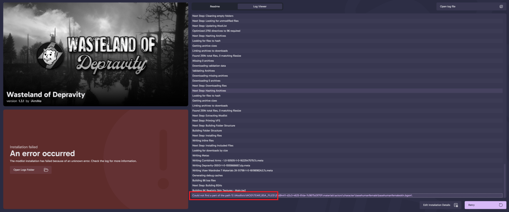

# FAQ

- [FAQ](#faq)
  - [Preface](#preface)
  - [Common Wabbajack errors](#common-wabbajack-errors)
    - [Missing files](#missing-files)
    - [Could not find part of the path](#could-not-find-part-of-the-path)
  - [Additions](#additions)
    - [Can I add xyz?](#can-i-add-xyz)
    - [Can I merge profiles?](#can-i-merge-profiles)
  - [Gameplay](#gameplay)
    - [Can I play the vanilla intro?](#can-i-play-the-vanilla-intro)
    - [Where all the crafting recipes?](#where-all-the-crafting-recipes)
    - [How do I acquire *volunteers* for my settlements?](#how-do-i-acquire-volunteers-for-my-settlements)
    - [Where is the Automation DLC content?](#where-is-the-automation-dlc-content)
    - [How do I cure trauma or reset attributes?](#how-do-i-cure-trauma-or-reset-attributes)
  - [Character Creation \& NPCs](#character-creation--npcs)
    - [Rotating the PC in LooksMenu](#rotating-the-pc-in-looksmenu)
    - [I have/an NPC has a neck seam](#i-havean-npc-has-a-neck-seam)
    - [Do I need to use Bodyslide?](#do-i-need-to-use-bodyslide)
    - [How do I edit my body?](#how-do-i-edit-my-body)
    - [Can I play as a male PC?](#can-i-play-as-a-male-pc)
    - [How do I add/remove tattoo's?](#how-do-i-addremove-tattoos)
  
## Preface
Please help me to help yourself here. Search this page and the [Common Issues page](CommonIssues.md) if you are having issues. Please also use the Discord search function in the WoD channels as your issue may already be solved. Do not just post a question in the support channel without doing your own research first.

## Common Wabbajack errors

>[!WARNING]
> If wabbajack throws an error, **DO NOT CLICK THE RETRY BUTTON**.  
Clicking the retry button will delete already downloaded mods and cause them to be downladed again, wasting your time.  
> 
> Instead, read carefully what kind of problem Wabbajack encountered, close Wabbajack, fix the error and then start the wabbajack installation again.

If you are not able to fix your Wabbajack error, or it is not listed in this list, please ask for support in our discord. Link is on the [first page](README.md) of this guide.

### Missing files
If you encounter an error looking like this:  

  
Click the "Show Missing Archives" button.  
A browser windows will open, showing the **EXACT NAMES** of the file you need to download, and a link to each file. Make sure you downloaded the correct file and the filenames match. Put the downloaded files in the Wabbajack downloads folder and start Wabbajack again.

### Could not find part of the path
If you encounter an error looking like this:  

Do the following:
1. Close wabbajack
2. Go to your install folder and locate the TEMP_BSA_FILES folder if it exists.
3. Empty that folder if it exists
4. Restart wabbajack
5. Restart Modlist installation.

## Additions

### Can I add xyz?
If you have to ask, probably not.

### Can I merge profiles?
Refer to the point above.

## Gameplay

### Can I play the vanilla intro?
No. It sucks and the game has been out since like, 2015. If you haven't played it by now, vanilla FO4 still exists.

### Where all the crafting recipes?
I know the mod pages say that they are all in the Chem Station *but* we have ECO and Complex Sorter.

That means, all recipes will have been moved to their appropriate work station in the Universal Workbench. You can follow the quest to grab a portable one by the entrance to Vault 111 or you can make static ones from a settlement build menu.

### How do I acquire *volunteers* for my settlements?
You need to craft a couple things at the Universal Workbench;

1. The Baton - find it in the `Weapon - Create` menu > Human Resources
2. A Kit - find it in the `Utility Station` menu > Human Resources

When an enemy gives up in combat, you can hit them with the baton to get started. Take them back to your settlement and then process them using the Human Resources Terminal.

### Where is the Automation DLC content? 
Integrated into the base game, properly. We use [Integrated Automation](https://www.nexusmods.com/fallout4/mods/85317).

### How do I cure trauma or reset attributes?
See the nurse in the Memory Den.

## Character Creation & NPCs

### Rotating the PC in LooksMenu
We have a mod for that.

- Right Mouse Button enables rotation;
- Middle Mouse Button enables movement of the character up, down, left and right;
- Shift + Mouse Wheel to zoom in and out.

### I have/an NPC has a neck seam
A lot of FO4 skin mods don't come with matching face textures, therefore leaving an obvious seam between the neck and body. Head into the High Poly Faces REDUX MCM and enable the `Seamless High Poly Head` for the player and then follow its instructions to fix it.

### Do I need to use Bodyslide?
No. See below.

### How do I edit my body?
2 ways;

1. In LooksMenu > Body > Advanced - play with the sliders to your hearts content.
2. Press F3 to open the Screen Archer Menu > Looks > Body Morphs > Load and pick a body preset.

### Can I play as a male PC?
You can if you want.

### How do I add/remove tattoo's?
In LooksMenu, Body sub-menu > Overlays.

If they are tattoos added on defeat, you can't remove them this way, go see the guy in the Dugout Inn.