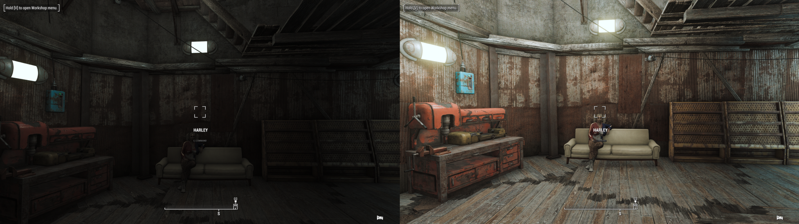

# FAQ

- [FAQ](#faq)
  - [Preface](#preface)
  - [Additions](#additions)
    - [Can I add xyz?](#can-i-add-xyz)
    - [Can I merge profiles?](#can-i-merge-profiles)
  - [Gameplay](#gameplay)
    - [Can I play the vanilla intro?](#can-i-play-the-vanilla-intro)
    - [Where all the crafting recipes?](#where-all-the-crafting-recipes)
    - [How do I acquire *volunteers* for my settlements?](#how-do-i-acquire-volunteers-for-my-settlements)
    - [How do I cure trauma or reset attributes?](#how-do-i-cure-trauma-or-reset-attributes)
    - [Automatron is not starting](#automatron-is-not-starting)
    - [All interior cells are too dark](#all-interior-cells-are-too-dark)
    - [I'm getting too many perk points per level](#im-getting-too-many-perk-points-per-level)
    - [Camera stuck in character creation](#camera-stuck-in-character-creation)
    - [I added Ivy, but she has no face](#i-added-ivy-but-she-has-no-face)
    - [Skadi has no face](#skadi-has-no-face)
    - [Sanctuary settlement layouts clip with existing buildings](#sanctuary-settlement-layouts-clip-with-existing-buildings)
    - [My mouse cursor can't reach the whole screen](#my-mouse-cursor-cant-reach-the-whole-screen)
  - [Character Creation \& NPCs](#character-creation--npcs)
    - [Rotating the PC in LooksMenu](#rotating-the-pc-in-looksmenu)
    - [I have/an NPC has a neck seam](#i-havean-npc-has-a-neck-seam)
    - [Do I need to use Bodyslide?](#do-i-need-to-use-bodyslide)
    - [How do I edit my body?](#how-do-i-edit-my-body)
    - [Can I play as a male PC?](#can-i-play-as-a-male-pc)
    - [How do I add/remove tattoos?](#how-do-i-addremove-tattoos)
  
## Preface
Please help me to help yourself here. Search this page and the [Common Issues page](CommonIssues.md) if you are having issues. Please also use the Discord search function in the WoD channels as your issue may already be solved. Do not just post a question in the support channel without doing your own research first.

## Additions

### Can I add xyz?
If you have to ask, probably not.

### Can I merge profiles?
Refer to the point above.

## Gameplay

### Can I play the vanilla intro?
No. It sucks and the game has been out since like, 2015. If you haven't played it by now, vanilla FO4 still exists.

### Where all the crafting recipes?
I know the mod pages say that they are all in the Chem Station *but* we have ECO and Complex Sorter.

That means, all recipes will have been moved to their appropriate work station in the Universal Workbench. You can follow the quest to grab a portable one by the entrance to Vault 111 or you can make static ones from a settlement build menu.

### How do I acquire *volunteers* for my settlements?
You need to craft a couple things at the Universal Workbench;

1. The Baton - find it in the `Weapon - Create` menu > Human Resources
2. A Kit - find it in the `Utility Station` menu > Human Resources

When an enemy gives up in combat, you can hit them with the baton to get started. Take them back to your settlement and then process them using the Human Resources Terminal.

### How do I cure trauma or reset attributes?
See the nurse in the Memory Den.

### Automatron is not starting
WoD uses [Integrated Automatron](https://www.nexusmods.com/fallout4/mods/85317).  
It imposes some delays and requirements before the quest may be started.  
For more information look at the mod page linked above.

### All interior cells are too dark
Open the ENB menu by pressing SHIFT+ENTER (default keybind).  
MAKE SURE THE Night/Interior preset is set to DEFAULT and not "Bright" under enbadaptation  
under enbadaption, Night> Adapt Max Bightness. lower = brighter

You can also enable the "Interior Lighting Overhaul" in NAC.X  
Open MCM -> NACX -> Settings and enable the setting.
Below is a comparison between the Off and On.

> [!TIP]
> If the settings seemingly does nothing, make a full save, quit to main menu, and reload the save.  
> This seems to happen if you start bilding lights in an interior cell, without reloading the cell, the setting doesn't always work.

### I'm getting too many perk points per level
You can adjust how many perk points you get per level.  

In MO2, search for pppl (see screenshot below), right click on it and select "Open in Explorer".  
Then navigate through the folder structure as follows: F4SE -> Plugins.  
There you will find the file pppl.ini  
In the green text at the top of the file you'll find a manual about how the file works.  

If you just want the default (1 perk point per level), just put 2=1 and delete the rest (see screenshot below).  
Save the file and close the explorer window.  

> [!WARNING]
> If you edit one of the files included in the mod, you should ask for support in the wod-modified channel in discord, as this is now a modified modlist.

### Camera stuck in character creation
If the camera is stuck behind Nate and Nora during character creation in the bathroom scene:
- Choose your desired gender
- Accept the default look
- Continue the guide until you are in the Commonwealth and have done your [Mod Setup](ModSetup.md)
- Go in 3rd person mode and turn the camera so you can see your character
- Open the console and type: slm 14
- Looksmenu for your character will now open and you can change the looks to whatever you want

### I added Ivy, but she has no face
This is a known issue, we are not sure yet what causes it.  

To fix it, do the following:
- Open the console and click on Ivy
- At the top of the console there should now be Ivy's name and her RefID (in brackets)
- Type in the console: slm RefID (for example: slm A6003491)
- With Ivy's LooksMenu open, change her Hairstyle to something else, and change it back
- Ivy's head should now be visible

> [!TIP]
> If the solution above does not work for you, you can install the [Wasteland Wonderglue Ivy Patch](https://www.nexusmods.com/fallout4/mods/86384?tab=files).  
>  
> Be aware that doing so is modifying your WoD install. Please ask your support questions in wod-support if you modfied your install.

### Skadi has no face
This is a known issue.  
  
To fix it, do the following:
- Open her inventory
- Remove her fishnet outfit and / or replace it with something else

### Sanctuary settlement layouts clip with existing buildings
If you want to use settlement layouts in sanctuary (and many other settlements), you have to remove the existing buildings.
- Repair the buildings in sanctuary
- While still in workshop mode, press the INSERT key (this will enable you to select more objects)
- Now scrap each of the rebuilt houses

You can now build your desired settlement layout.

### My mouse cursor can't reach the whole screen
Windows Scaling can prevent games displaying correctly, often resulting in appearing "zoomed in". To mitigate this, follow the steps outlined in the image below.  

**__Remember__**: You need to do this in the Stock Game folder and not your Steam install folder!
For Fallout 4 modlists, it's Stock Game\Fallout4.exe

## Character Creation & NPCs

### Rotating the PC in LooksMenu
We have a mod for that.

- Shift + Left Mouse Button rotates
- Shift + Right Mouse Button moves
- Shift + Mouse Wheel zooms in and out

### I have/an NPC has a neck seam
A lot of FO4 skin mods don't come with matching face textures, therefore leaving an obvious seam between the neck and body. Head into the High Poly Faces REDUX MCM and enable the `Seamless High Poly Head` for the player and then follow its instructions to fix it.

### Do I need to use Bodyslide?
No. See below.

### How do I edit my body?
2 ways;

1. In LooksMenu > Body > Advanced - play with the sliders to your hearts content.
2. Press F3 to open the Screen Archer Menu > Looks > Body Morphs > Load and pick a body preset.

### Can I play as a male PC?
You can if you want.

### How do I add/remove tattoos?
In LooksMenu, Body sub-menu > Overlays.

If they are tattoos added on defeat, you can't remove them this way, go see the guy in the Dugout Inn.
