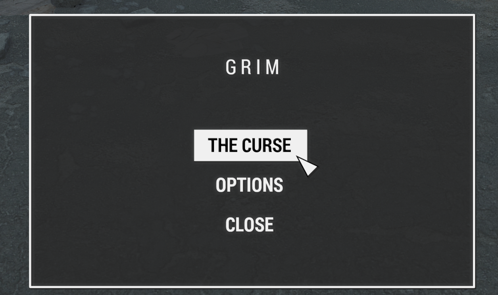

# Give Me Spoop Profile

## Profile Specific Setup
Follow the regular readme, up to the point of applying the MCM settings. After doing that, come back here and follow these additional steps:

1. Open your Pipboy menu, navigate to `Apparel` and find the `GRIM : MENU` item and then click it.

2. Close out of the Pipboy menu and in the GRIM menu that opens, click `OPTIONS`.

3. Click the `Enable Grim for ENB` option.

4. Re-open the GRIM menu

5. Enable `The Curse`

6. Done!