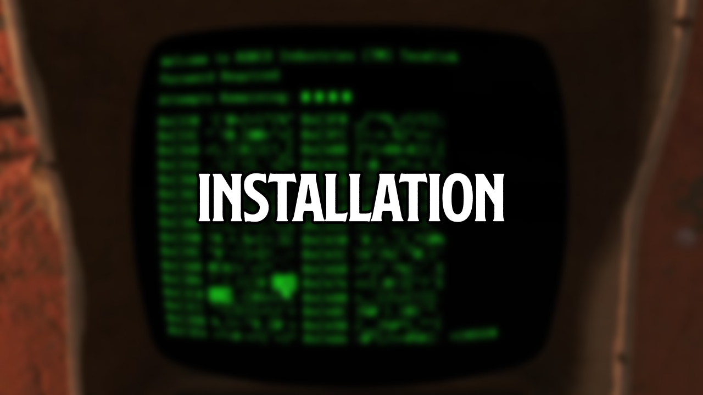

[ <a href="https://github.com/iAmMe27/WoD/blob/main/README.md">Getting Started</a> ]
[ Installation ]
[ <a href="https://github.com/iAmMe27/WoD/blob/main/PostInstall.md">After Install</a> ]
[ <a href="https://github.com/iAmMe27/WoD/blob/main/ModSetup.md">Mod Setup</a> ]
[ <a href="https://github.com/iAmMe27/WoD/blob/main/Controls.md">Controls</a> ]
[ <a href="https://github.com/iAmMe27/WoD/blob/main/CommonIssues.md">Common Issues</a> ] 

&nbsp;

# Content
- [Content](#content)
- [Preparation](#preparation)
  - [Setup your Page File](#setup-your-page-file)
  - [Setup your Antivirus](#setup-your-antivirus)
  - [Disable Steam Overlay](#disable-steam-overlay)
  - [Remove OneDrive](#remove-onedrive)
  - [Set game language to English](#set-game-language-to-english)
  - [Change Steam's Updating Behavior](#change-steams-updating-behavior)
  - [Install Fallout 4](#install-fallout-4)
  - [Start Fallout 4](#start-fallout-4)
  - [Download non-Nexus mods](#download-non-nexus-mods)
- [Install WoD in Wabbajack](#install-wod-in-wabbajack)
  - [Select the Modlist](#select-the-modlist)
  - [Select Installation \& Download Folders](#select-installation--download-folders)
    - [Installation Folder \[1\]](#installation-folder-1)
    - [Download Folder \[2\]](#download-folder-2)
    - [Starting the Installation \[3\]](#starting-the-installation-3)
  - [Installation is finished](#installation-is-finished)
- [Continuing](#continuing)

# Preparation
This document will show you how to prepare your System for the modlist installation, install the base game and finally, install WoD.

> [!CAUTION]
> **The steps listed here are not optional and must be followed.**

## Setup your Page File
You should setup a pagefile of at least **20GB** - yes, even if you have a million GB of RAM. To setup your pagefile;

1. Hold down the *LEFT* Windows key and press **R**
2. Type in `systempropertiesadvanced` in the run box and then press ENTER
3. Under the "Performance" option, click the "Settings..." button
4. Switch to the "Advanced" tab
5. Under "Virtual Memory", click the "Change..." button
6. Uncheck `Automatically manage...` if it's checked
7. Select your *fastest* SSD in the list of drives
8. Check "Custom Size"
9. Set `Initial Size` to 20480
10. Set `Maximum Size` to 40000
11. Press the "Set" button
12. Press `OK`
13. Press `APPLY` and then `OK`
14. Restart your PC to apply the pagefile setting

## Setup your Antivirus
Before you go down the route of "I don't have an antivirus" - you do, it's built into Windows. You need to exclude your Wabbajack folder and your WoD installation folder from your antivirus' real-time protection stuff as it will likely interfere with your install and worst case, it can remove files, ruining your install. It can and will interfere whilst you are playing too, causing poor performance and obvious stuttering.

> [!TIP]
> How do I do this, you ask? [Click here to find out how.](https://support.microsoft.com/en-gb/windows/add-an-exclusion-to-windows-security-811816c0-4dfd-af4a-47e4-c301afe13b26)

**Note:** If you're using Webroot or any other free 3rd party antivirus it's likely that adding the folders to exclusions will not be enough and you'll need to disable or uninstall your 3rd party AV as they can incorrectly mark `usvfs_proxy_x86.exe`, among other files, as a virus, a file needed for Mod Organizer 2 to work. We recommend doing so anyway in case it's a free one, as Windows Defender is likely much better at stopping threats than that is (according to data from av-test.org https://www.av-test.org/en/antivirus/home-windows/).

## Disable Steam Overlay
Head into Steam, right clicking on Fallout 4 in your game library and clicking **Properties** > **General** > **Deselect "Enable Steam Overlay while in-game"**.

## Remove OneDrive
If you have OneDrive and it is sync'ing your Documents folder, it's time to remove it. It will interfere with saves and will lead to crashes whilst you're playing.

## Set game language to English
Right click on Fallout 4 in your game library and click **Properties** > **Language** > **Select English**.

## Change Steam's Updating Behavior
Right click on Fallout 4 in your game library and clicking **Properties** > **Updates** > **Change Automatic Updates to "Only update this game when I launch it"**. Whilst you're in here, it's also recommended to disable Steam Cloud too.

## Install Fallout 4
Once you've done the steps above, you can now set Steam to download Fallout 4 but ***do not*** install Fallout 4 to a protected folder, such as `Desktop`, `Downloads` or `Program Files` of any kind. It's best to create a new, dedicated folder for it using the Steam Library function somewhere on the root of your drive such as `C:\SteamLibrary`. A lot of people have a dedicated secondary drive for their games, keeping the OS install separate; using this secondary drive will also work.

## Start Fallout 4
Yup - start the game. ಠ_ಠ

## Download non-Nexus mods

>[!TIP]
> I recommend that you setup 2 folders for your installation.  
> For example, use `C:\WoD` for your installation folder and `C:\WoD Downloads` for your downloads folder.
>
> That way you will still have your downloads if you need to reinstall / reset or upgrade the list and don't need to redownload everything.

It is required that you download all non-Nexus mods in your browser prior to running Wabbajack. All links to mods not hosted on Nexus Mods can be [found here](https://github.com/iAmMe27/WoD/wiki/).  
Download them and put them ***as they are*** in the Wabbajack download folder. This is the folder you're going to tell Wabbajack to download into later on. ***DO NOT EXTRACT THE ZIP FILES, PUT THEM IN THE FOLDER AS THEY ARE!***

> [!CAUTION]
> Currently, downloading Loverslab mods through wabbajack does not work. Even though it shows the mod page and you can click the download button, it will not pass the file check at the end and Wabbajack will throw an error. Don't skip this step, even if you successfully downloaded LL mods through wabbajack in the past.

# Install WoD in Wabbajack
Installing the list is straight forward, Wabbajack will do most of the heavy lifting for you - you only have to tell it where to put stuff.

## Select the Modlist
Open Wabbajack.  
Always open Wabbajack with the Wabbajack Launcher.exe instead of the wabbajack.exe directly to make sure you're always using the latest version.

- Click on "Browse lists"

- In the next window, make sure the "NSFW" toggle is **__toggled ON__**, and search for the name of the modlist.  
Once it shows up on the right, click on it.

- Once the detailed view is open, click "Download & Install".

## Select Installation & Download Folders

### Installation Folder [1]
This folder is where the modlist will be **__installed in__**.  
Set the installation location to a folder on the root of a drive, something like `C:\WoD`.  

> [!CAUTION]
> Do not install WoD to your game folder or in any protected folders such as your Documents or Program Files.

### Download Folder [2] 
This folder is where the downloaded mods will be stored.  

> [!TIP]
> If you want to save space on your fast SSD, this folder can be stored on slower drives, even an HDD.  
> We suggest you keep your downloads and don't delete them after, so if you want to update or reinstall the list, you don't have to download everything all over again.

### Starting the Installation [3]
Once you have set your folders, hit **GO** and let it do its thing.

> [!CAUTION]
> Once you click "Install", there is no going back, the installation will start.
>
> Therefore, make **DOUBLE SURE** you have set your Download and Installation folder correctly.  
> Upon start of the installation, your Installation folder **WILL BE EMPTIED**.  
> So if you have them the wrong way around, Wabbajack can **and will DELETE ALL YOUR DOWNLOADS**!
>
> You have been warned.

## Installation is finished
Once the install is finished, you will see the following screen.  
Click "Open in File Explorer" to open your installation folder and start ModOrganizer.exe in there, then continue to the next step.

If your screen does not like this (especially if you have a red box with an error on the lower left), have a look at our [Common Issues](CommonIssues.md) page. 

# Continuing
If Wabbajack was able to install the modlist without any errors, you can continue with the [After Installation steps](PostInstall.md).
