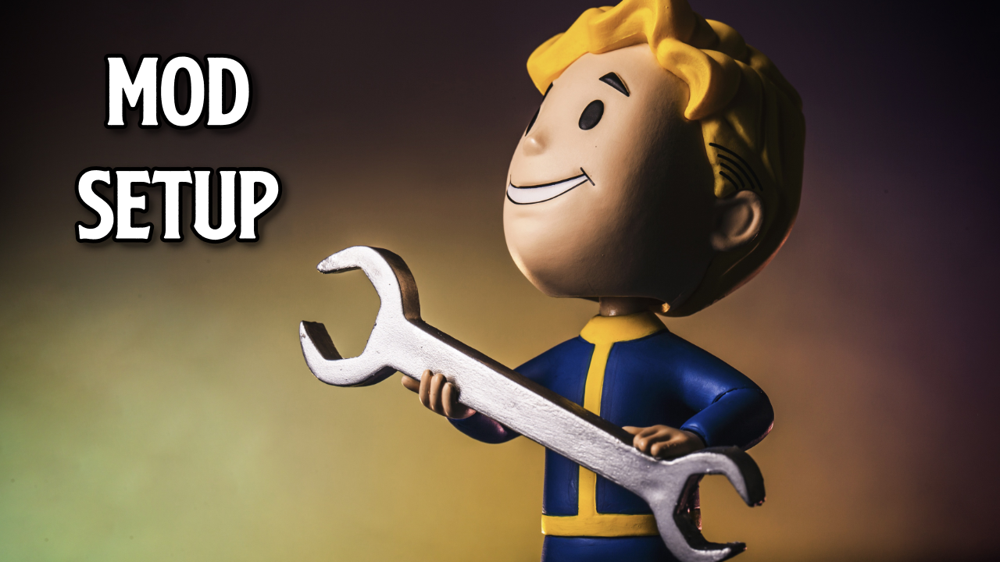
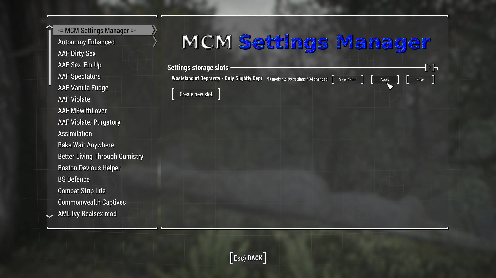
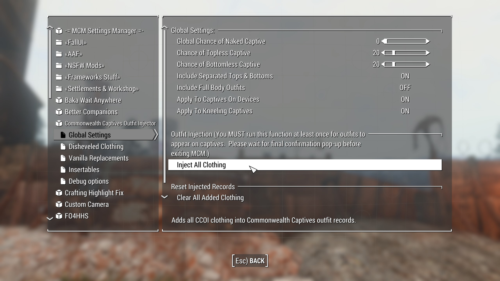

<p align="center">
[ <a href="https://github.com/iAmMe27/WoD/blob/main/README.md">Getting Started</a> ]
[ <a href="https://github.com/iAmMe27/WoD/blob/main/Installation.md">Installation</a> ]
[ <a href="https://github.com/iAmMe27/WoD/blob/main/PostInstall.md">After Install</a> ]
[ Mod Setup ]
[ <a href="https://github.com/iAmMe27/WoD/blob/main/Controls.md">Controls</a> ]
[ <a href="https://github.com/iAmMe27/WoD/blob/main/CommonIssues.md">Common Issues</a> ] 
</p>

&nbsp;

# Content
- [Content](#content)
- [Mod setup](#mod-setup)
  - [Optional MCM Configs](#optional-mcm-configs)
    - [Swags Dommy Mommy Milkers Wasteland](#swags-dommy-mommy-milkers-wasteland)
    - [I want to play as a male](#i-want-to-play-as-a-male)
- [Need support?](#need-support)

# Mod setup
When starting a new game, create your character and once done, *DO NOTHING ELSE* and allow the mods to initialise. Once the notifications stop appearing in the top left of your screen, proceed to open the door to the bathroom and make your choice as to how you'd like to start the game.  
  
> [!WARNING]
> Do not touch MCM menus until you are either out of Vault 111 or you have loaded into the Commonwealth.

> [!NOTE]
> All profiles have an MCM setup that you *must* apply!

The MCM setup is a one-click solution and will run when you tell it to. To do that;

1. Navigate to the Mod Config menu -> `-= MCM Settings Manager =-`
2. Click the `[Apply]` button.



3. Scroll down to find `Commonwealth Captives Outfit Injector`, head to `Global Settings`, click `Inject All Clothing` and wait for a message box to pop-up telling you that the outfit injection is done.



4. Exit the Mod Config menu

5. One that is done, make a new full save from the pause menu.

## Optional MCM Configs

>[!IMPORTANT]
> You must apply the main MCM config ***before*** you apply any of these optional settings.

### Swags Dommy Mommy Milkers Wasteland

> [!NOTE]
> this MCM setup is for profile 2 only!

```
What does the MCM Preset "Swags Dommy Mommy Milkers Wasteland" do?
It pretty much does 2 main things.

  1. Adjusts, where possible, all MCM options to be only targeted/approached by female NPCs,
  2. Some personal "Quality of Life" adjustments, for example, tweaking the chance of certain events that can happen etc.

If you don't like heavily female oriented playthroughs, this is not the config for you.
```

### I want to play as a male
This is an optional set of tweaks for male characters. A lot of the adult content based mods assume your character is female and this tweaks changes things for male player characters where possible.

# Need support?
If you encounter any problems during installation, please have a look at our [Common Issues](CommonIssues.md) page.  
If you want to an overwiew over gameplay changing mods, have a look at the [Gameplay](Gameplay.md) page.  
You maybe also want to have a look at the [FAQ](FAQ.md) where we cover some of the questions we encounter the most.  

If your question is not answered in the documentation, please feel free to ask in our discord, as stated on the fist page of the [Readme](README.md).
