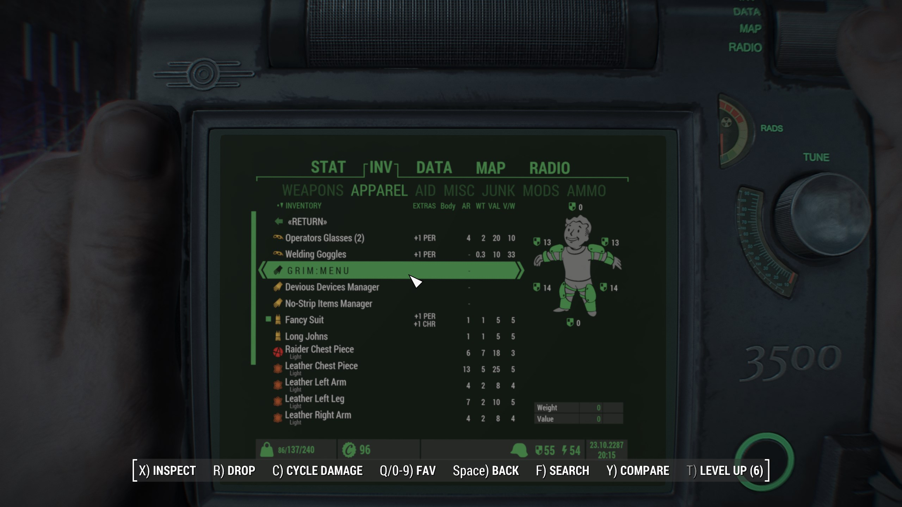
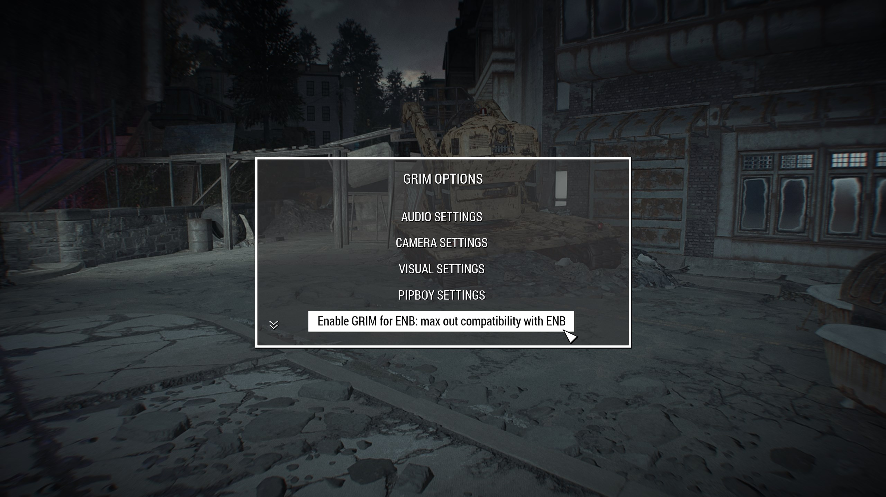

# The other Wasteland of Depravity Readme

***This page is only applicable to the profile released with v0.7.3, containing new content!***

Same as before, do not do anything in any MCM's until you have left the bathroom scene. Once you've left the bathroom scene and you've loaded into the world follow these steps:

When starting a new game, create your character and once done, DO NOTHING ELSE and allow the mods to initialise. Once the notifications stop appearing in the top left of your screen, proceed to open the door to the bathroom and make your choice as to how you'd like to start the game.

*    When LIF gives you a pop-up at the start of the game, click `INJECT`

*    When ECO gives you a pop-up at the start of the game, click `Keep Everything Enabled (Default)`

Do not touch MCM menus until you are loaded into the Commonwealth. Once you are in the Commonwealth, pause your game, click Mod Config menu, go to `-= MCM Settings Manager =-` and then apply the `Wasteland of Horrors` MCM settings.

Scroll down to find `Commonwealth Captives Outfit Injector`, head to `Global Settings`, click `Inject All Clothing` and wait for a message box to pop-up telling you that the outfit injection is done.

Exit the Mod Config menu.

After that, you'll want to Enable GRIM for ENB by finding the item in your inventory, activating it, closing your Pip-Pad and then selecting the appropriate option from the menu.

One that is done, make a new full save from the pause menu.

Done!