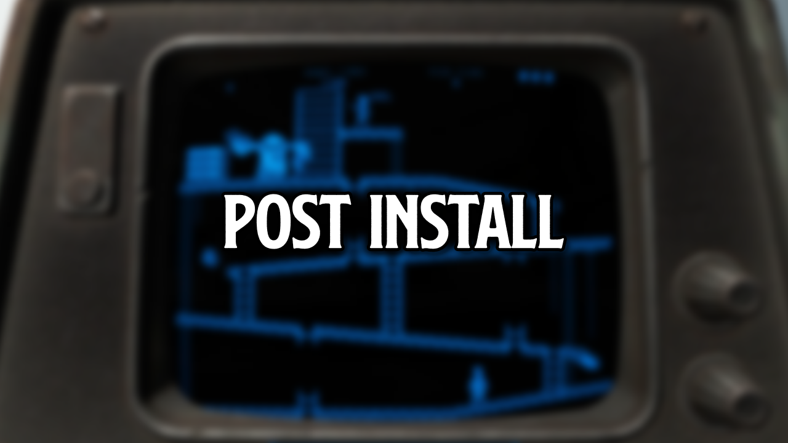
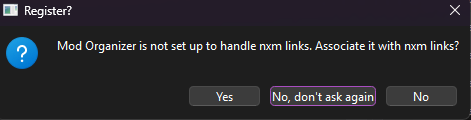

[ <a href="https://github.com/iAmMe27/WoD/blob/main/README.md">Getting Started</a> ]
[ <a href="https://github.com/iAmMe27/WoD/blob/main/Installation.md">Installation</a> ]
[ After Install ]
[ <a href="https://github.com/iAmMe27/WoD/blob/main/ModSetup.md">Mod Setup</a> ]
[ <a href="https://github.com/iAmMe27/WoD/blob/main/Controls.md">Controls</a> ]
[ <a href="https://github.com/iAmMe27/WoD/blob/main/CommonIssues.md">Common Issues</a> ] 

&nbsp;

# Content
- [Content](#content)
- [After installation steps](#after-installation-steps)
  - [Handling nxm links](#handling-nxm-links)
  - [What's the difference between the 3 profiles?](#whats-the-difference-between-the-3-profiles)
  - [Running WoD](#running-wod)
  - [Optional Mods](#optional-mods)
    - [Essentials Category](#essentials-category)
    - [YOUR CHOICES Category](#your-choices-category)
- [Continuing](#continuing)

# After installation steps
Navigate to the WoD installation folder and run MO2 by double-clicking `ModOrganizer.exe`.

> [!WARNING]
> DO NOT UNDER ANY CIRCUMSTANCES RUN LOOT. The load order is exactly as intended out of the box and you do not need to change it.

## Handling nxm links

You can select whatever suits you best in this dialog box.
If you click yes, MO2 will open automatically when you select "Download with Mod Manager" on a mod page on NexusMods.

## What's the difference between the 3 profiles?
Profile #1 contains the usual depravity (humans only).  
Profile #2 is for coomers who like NSFW artwork and creature *interactions* (yes, that means sex with creatures).  
Profile #3 is self explanatory (it makes the game harder, and before you ask; nsfw wise, it's built on Profile #2).

## Running WoD
Running WoD is as simple as clicking Run with the `Fallout: Wasteland of Depravity` option selected in the MO2 dropdown menu, in the top right of the window.

> [!WARNING]
> **Do not** click the `Unlock` button in MO2 whilst WoD is running. Doing this *will* cause issues and potentially crashes.

## Optional Mods
In Wasteland of Depravity, there are a few optional mods that you can toggle on/off for your playthrough.

### Upscaler
1. Upscaling - this mod adds FSR, DLSS and DLAA upscaling to Fallout 4. Remember to configure this mod in it's MCM.

### Frame Gen Category
*Note: if you want to use Frame Gen, you must activate the `Motion Vectors Fix` mod in MO2 also. Frame Gen can also introduce artifacting and ghosting on your screen as you play.*

1. Frame Generation - this will add FSR3 frame generation to Fallout 4.
2. Motion Vector Fixes - required for frame generation to work.

### Fuck my shit up Category
1. Unleveled World - this will remove level caps on enemies and loot, meaning you will run into enemies who are much higher level than you but also the guns you find can be better.

### Danger Zone Category
1. Uneducated Shooter - this addes weapon interia and QE leaning, like in other games such as Rainbow Six Siege.

### AMD & Intel GPU Fixes
1. WoD - AMD Fixes - this mod fixes a few texture/mesh issues specific to AMD and some Intel GPUs.

### YOUR CHOICES Category
1. Discord Rich Presence (F4SE) - this gives you a card in Discord when you are playing WoD. It lists your character name, level and location. *It does not hook into the NSFW mods, don't worry, your secrets are safe.*
2. LOD Hiding Fog for NAC X - adds a small amount of fog to the clear and sunny weathers to help hide those nasty Fallout 4 LODs.
3. Swags Optional Stuff - Changes Brothel visitors to females only.
4. Swags RDM Edit - Reduces the RDM headshot multipliers for some enemies to make them not 1 shot.
5. BugOut - replaces bugs with other enemies.

# Continuing
When you are comfortable with your choices and finally want to play, continue with the last step; [Mod Setup](ModSetup.md).
