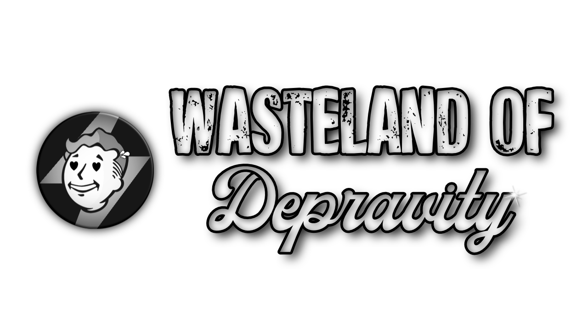

[ Getting Started ]
[ <a href="https://github.com/iAmMe27/WoD/blob/main/Installation.md">Installation</a> ]
[ <a href="https://github.com/iAmMe27/WoD/blob/main/PostInstall.md">After Install</a> ]
[ <a href="https://github.com/iAmMe27/WoD/blob/main/ModSetup.md">Mod Setup</a> ]
[ <a href="https://github.com/iAmMe27/WoD/blob/main/Controls.md">Controls</a> ]
[ <a href="https://github.com/iAmMe27/WoD/blob/main/CommonIssues.md">Common Issues</a> ] 

&nbsp;

First things first: **this list contains adult content and you must be of legal age in your country. This means 18+ in most countries, 21+ in others. It is up to you to be sure of the age requirement in your country.**

# Content
- [Content](#content)
- [Quick Links](#quick-links)
- [Preface](#preface)
- [Getting Started](#getting-started)
  - [Hardware Requirements](#hardware-requirements)
  - [Storage Space](#storage-space)
  - [Accounts](#accounts)
  - [Fallout 4 Install](#fallout-4-install)
  - [DLC](#dlc)
- [Updating Wasteland of Depravity](#updating-wasteland-of-depravity)
- [Need Support?](#need-support)
  - [Asking for support in Discord](#asking-for-support-in-discord)
- [Support me?](#support-me)
- [Continuing](#continuing)

# Quick Links
:computer:  DLAA FOR NVIDIA RTX GPU USERS >[CLICK HERE](DLAA.md)<

:tv:  I have an Ultrawide monitor! >[CLICK ME](Ultrawide.md)<
  
:file_folder: Having issues with downloads in Wabbajack? [Check this page first.](https://github.com/iAmMe27/WoD/wiki)

# Preface
Just to set some expectations and boundaries surrounding modlist development here, there's a couple things I'd like to say first.

1. As a modlist user, I expect some small efforts into fixing your own issues, mostly by searching the documentation provided here and by the Discord channels. It's very likely any issue you encounter has already been solved - if this is the case and it's well known, don't be surprised if you get ignored.
   
2. Support shouldn't be expected as instant - I have a full time job on top of this, as do my mod team, so I ask for a little bit of patience.
   
3. Do not expect a 100% polished, well-balanced and "perfect" experience. I am a 1-person dev team and expecting more from me than you would from AAA game studios is insanity.
   
4. We're modding a nearly 10 year old game here, please temper your expectations some.

> [!TIP]
> Because most of the mods are developed with a female player character in mind, the modlist is geared heavily towards a female player character. 
>
> While it is technically possible to play as a male, and we do have some settings for a male playhtrough, you will still experience immersion breaking dialogue and some NPCs will refer to you as a female.
>
> **Because of this, we generally recommend a female player character to get the most out of your experience.**
>
> Additionally it is a known bug that certain male presets / hairstyles like to crash the game.  
> You have been warned.

# Getting Started

## Hardware Requirements

|             | CPU                             | RAM                 | GPU                                             |
|-------------|---------------------------------|---------------------|-------------------------------------------------|
| Minimum     | Intel 7th Gen,  AMD 3000 Series | 16GB DDR4 @ 3000MHz | RTX 2060, Radeon 5700 XT (at least 6GB of VRAM) |
| Recommended | Intel 9th Gen, AMD 5800X        | 32GB DDR4 @ 3600MHz | RTX 3070, Radeon 6800                           |

## Storage Space

|             | Total Space   | Storage Type        |
|-------------|---------------|---------------------|
| Minimum     | 400GB         | SATA SSD            |
| Recommended | 400GB         | NVMe SSD            |

## Accounts
In terms of accounts you will need:
  * Nexus Premium Account
  * LoversLab Account - *for manual downloads through your browser.*

## Fallout 4 Install
> [!WARNING]
> Your Steam install of Fallout 4 must be up to date - do not downgrade for WoD!
>
> As of version 1.5.2, Wasteland of Depravity is compatible with the Anniversary Edition update of Fallout 4.

## DLC
You will need *all* of the DLC for Fallout 4 ***except*** the official HD texture pack.  

> [!TIP]
> If you have the Game of the Year (GOTY) edition of Fallout 4, you're good to go, it includes all the needed DLC.
>
> While it is not a problem for the modlist instllation to have High Resolution DLC installed, you can save ~60GB of space on your SSD by not having it installed.

# Updating Wasteland of Depravity
To update WoD, do the same steps as in installation, but point the Wabbajack install folder to your curernt WoD folder.

> [!IMPORTANT]
> If you've added mods, you better know how to stop Wabbajack from removing them.

# Need Support?

If you encounter any issues that are not answered in the installation routine, have a look at [Common Issues](CommonIssues.md) first.  
Gameplay information about some key mods in the list [here](Gameplay.md).  
There is also a [FAQ](FAQ.md) with common questions about MO2 and common ingame issues. 

If the documentation provided does not provide you with an answer, or if you just want to chat and hang out, feel free to join our discord (link below).

> [!WARNING]
> Only Windows 10 or 11 operating systems are supported. Windows LTSC, special variants, lightened editions or any other modified variant ***WILL NOT WORK.*** Linux installations also ***WILL NOT WORK.*** If you get it working on Linux, that's great, but not something we can officially support.

## Asking for support in Discord
If you want to ask for support in Discord, grab the "Wasteland" role in onboarding or in "Channels & Roles" at the top of the channel list.  
Before asking your question, please use the discord search function and check pinned messages in relevant channels.

Still haven't found an answer to your problem?  
Please make sure to ask your question in the appropriate channel.

- wod-general -> General discussion about the list or included mods.
- wod-modified -> Support-Channel for vanilla installs (if you changed files, added or deleted mods in your install, ask for support here).
- wod-support -> Support-Channel for vanilla (unchanged) installs.

# Support me?

If you like the modlist, consider buying me a coffee or something.  

# Continuing
If you are sure you meet all the requirements above, you can continue with the [Installation](Installation.md).
