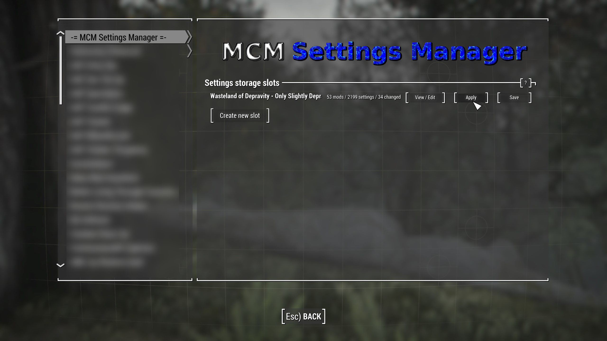

First things first: **this list contains adult content and you must be of legal age in your country. This means 18+ in most countries, 21+ in others. It is up to you to be sure of the age requirement in your country.**

*Support and general talk about Wasteland of Depravity resides on the Jolly Co-operators Discord:*

[](https://discord.gg/jolly-coop)

[](https://ko-fi.com/Z8Z7CKSPJ)

---
## DO NOT CLOSE THIS README. FAILURE TO FOLLOW THIS README WILL RESULT IN EITHER AN UNINSTALLABLE OR NON-FUNCTIONING MODLIST!
---

# What is Wasteland of Depravity?
A NSFW Fallout 4 list with modern weapons, plenty of extra quests and plenty of new outfits.

# Quick Links
* FAQ? > [FAQ!](FAQ.md)
* Common Issues > [CLICK HERE](#common-issues)
* Having issues with downloads in Wabbajack? [Check this page first.](https://github.com/iAmMe27/WoD/wiki)
* What the heck am I doing with these mods? [Read this page.](Gameplay.md)

# Before You Start
Before you dive in, there's a couple things you need to be sure of first:

## Hardware Requirements
I have not built this list to be as graphically intensive as possible but I have installed some nice texture overhauls and a real nice ENB so, with that in mind, I'd say you would need at least the following specs to run WoD @ 1440p:

|             | CPU                             | RAM                 | GPU                                             |
|-------------|---------------------------------|---------------------|-------------------------------------------------|
| Minimum     | Intel 7th Gen,  AMD 3000 Series | 16GB DDR4 @ 3000MHz | RTX 2060, Radeon 5700 XT (at least 6GB of VRAM) |
| Recommended | Intel 9th Gen, AMD 5800X        | 32GB DDR4 @ 3600MHz | RTX 3070, Radeon 6800                           |

This could be completely out of field though as I don't have any lower end hardware to test it on.

You will need at least `240GB` of disk space on an SSD for the installation. For the downloads, you will need an extra `150GB`- ideally you want *at least* `390GB` total for install and for temporary Wabbajack work space. You don't have to install onto an NVMe SSD but a HDD will be too slow for playing on. Once WoD is installed, you can move the downloads to a storage HDD or even delete them if you wish.

## Accounts
In terms of accounts you will need:
  * Nexus Premium Account
  * LoversLab Account - *for manual downloads through your browser.*
  * [Moddingham Account](https://www.moddingham.com/) - *you need this for the latest version of AAF.*

## DLC & Creation Club Content
You will need *all* of the DLC for Fallout 4 ***except*** the official HD texture pack. Seriously, do not download it. 

Creation Club content is not currently supported as I don't own any of it.

# Installation

**I would heavily recommend that you download the LoversLab mods in your browser prior to running Wabbajack. Doing this may be long winded but can prevent a lot of issues from happening. [All links to mods hosted on LoversLab can be found here.](https://github.com/iAmMe27/WoD/wiki/LoversLab-Files)**

**When downloading mods from Mega, always right click > Standard Download. Mega defaults to its "Download as ZIP" option will means it recompresses already compressed files and Wabbajack won't be able to recognise the download.**

After downloading the non-Nexus mods, put them all into the folder you'd like the rest of the WoD downloads to be stored in. If you have an existing FO4 mods downloads folder from other modlists or your own modding, use that as you might have mods WoD needs already, meaning you won't need to download those mods again.

## Preparation

### Install Microsoft Visual C++ Redistributable Packages
This package is a must as it is needed by MO2 - you may already have it if you've used MO2 before. If you do not have it, you want to download the x64 version under "Visual Studio 2015, 2017 and 2019".

[Download Visual C++ Redistributable Package.](https://docs.microsoft.com/en-us/cpp/windows/latest-supported-vc-redist?view=msvc-170)

### Setup your Page File
Fallout 4 modlists need a large amount of memory purely because of the amount of *stuff* in them - especially modlists on the larger side or with a lot going on. For the best experience, you should setup a pagefile of at least **20GB** - yes, even if you have a million GB of RAM. To setup your pagefile;

1. Hold down the *LEFT* Windows key and press **R**
2. Type in `systempropertiesadvanced` in the run box and then press ENTER
3. Under the "Performance" option, click the "Settings..." button
4. Switch to the "Advanced" tab
5. Under "Virtual Memory", click the "Change..." button
6. Uncheck `Automatically manage...` if it's checked
7. Select your *fastest* SSD in the list of drives
8. Check "Custom Size"
9. Set `Initial Size` to 20480
10. Set `Maximum Size` to 40000
11. Press the "Set" button
12. Press `OK`
13. Press `APPLY` and then `OK`
14. Restart your PC to apply the pagefile setting

### Setup your Shader Cache
Driver defaults from Nvidia and AMD for shader cache size is limited to 4GB. Being this small can lead to rare crashes in heavily modified Fallout 4 installs. Increasing the shader cache size is done via the Nvidia Control Panel (I assume the same for AMD users is true also but I don't have AMD hardware to check with). 

**AMD USERS:** [See this link for some manual tweaks that may or may not help.](https://www.reddit.com/r/Eldenring/comments/t1b8bb/i_found_a_possible_fix_for_stuttering_on_amd_cards/)

1. Open the NVidia Control Panel
2. Head to `Manage 3D Settings`
3. Scroll down in `Global Settings` to find the `Shader Cache Size` option
4. Set the Shader Cache to *at least* 10GB
5. Done


### Setup your Antivirus
Before you go down the route of "I don't have an antivirus" - you do, it's built into Windows. You need to exclude your Wabbajack folder and your WoD installation folder from your antivirus' real-time protection stuff as it will likely interfere with your install and worst case, it can remove files, ruining your install. It can and will interfere whilst you are playing too, causing poor performance and obvious stuttering.

How do I do this, you ask? [Click here to find out how.](https://lmgtfy.app/?q=how+to+add+exclusions+to+antivirus)

**Note:** If you're using Webroot or any other free 3rd party antivirus it's likely that adding the folders to exclusions will not be enough and you'll need to disable or uninstall your 3rd party AV as they can incorrectly mark `usvfs_proxy_x86.exe`, among other files, as a virus, a file needed for Mod Organizer 2 to work. We recommend doing so anyway in case it's a free one, as Windows Defender is likely much better at stopping threats than that is (according to data from av-test.org https://www.av-test.org/en/antivirus/home-windows/).

### Disable Steam Overlay
The Steam overlay is known to cause issues when using ENBs. I recommend you turn it off to be sure that it doesn't interfere in any way and you can do so by heading into Steam, right clicking on Fallout 4 in your game library and clicking **Properties** > **General** > **Deselect "Enable Steam Overlay while in-game"**.

### Set game language to English
Wabbajack and the modding tools out there only support English language versions of games. Setting the language to English in Steam will stop issues like Wabbajack file verification failures when installing. As with disabling the overlay, right click on Fallout 4 in your game library and click **Properties** > **Language** > **Select English**.

### Change Steam's Updating Behavior
If for some reason Bethesda decide to release an update for Fallout 4, everything will probably break. Well, not *everything* but something will definitely break until mods can be updated to suit. To stop this from happening, you need to tell Steam that you only want to update when you tell it to. You can do this by right clicking on Fallout 4 in your game library and clicking **Properties** > **Updates** > **Change Automatic Updates to "Only update this game when I launch it"**. Whilst you're in here, it's also recommended to disable Steam Cloud too.

### Clean current Fallout 4 installation
If you have not yet installed Fallout 4, you can skip this part.

1. Right click on Fallout 4 in your game library and click **Properties** > **Local Files** > **Browse**. 
2. Uninstall the game via Steam - right click on Fallout 4 in your game library and click **Manage** > **Uninstall**.
3. Check the explorer window for any left over files - if there are any, delete them.
4. Open Windows start menu/search and type in `%LOCALAPPDATA%`.
5. Delete the Fallout 4 folder.
6. Head to `Documents\My Games` and delete the Fallout 4 folder.

### Install Fallout 4
Once you've done the steps above, you can now set Steam to download Fallout 4 again but ***do not*** install Fallout 4 to a protected folder, such as `Desktop`, `Downloads` or `Program Files` of any kind. It's best to create a new, dedicated folder for it using the Steam Library function somewhere on the root of your drive such as `C:\SteamLibrary`. A lot of people have a dedicated secondary drive for their games, keeping the OS install separate; using this secondary drive will also work.

### Start Fallout 4
That's right - start the game. You need to let the game do its initial start up jobs such as creating registry entries and generating default config files. Once you've gotten to the main menu you can close the game again.

## Wabbajack
Installing the list is straight forward, Wabbajack will do most of the heavy lifting for you - you only have to tell it where to put stuff.

Set the installation location to a folder on the root of a drive, something like `C:\WoD`. Do not install it to one of the protected folders as mentioned earlier. The download location will have likely been filled in for you too - ensure it matches the directory you set for the installation location, or if you have multiple Fallout 4 modlists installed, use a common download folder - this will stop you from having to redownload common mods across multiple modlists. 

Once you have everything set in Wabbajack, hit **GO** and let it do its thing. It might take a while as there is a fair bit to download and the speed of this will depend on your internet performance as well as your CPU in the later stages for hashing and unpacking the downloads.

# Post-Installation
Almost there but we're not out of the woods yet! After Wabbajack has given you the installation successful screen, you're free to close it. Navigate to the WoD installation folder and run MO2 by double-clicking `ModOrganizer.exe`.

***DO NOT UNDER ANY CIRCUMSTANCES RUN LOOT. The load order is exactly as intended out of the box and you do not need to change it.***

## Stock Game
WoD utilises the stock game feature offered by Wabbajack, meaning that Wabbajack will make a local copy of your Fallout 4 game files during the installation process. This means that your Steam installation of Fallout 4 is completely untouched, even by files that go in the game folder such as ENB files.

## Creating a desktop shortcut
Nobody wants to be launching their game via multiple clicks, they want to be able to do it from the desktop! This is simple to do - open MO2, ensure **WoD** is selected in the dropdown and click the "Shortcut" button. From the small dropdown menu, click "Desktop". Of course, you can always run from inside of MO2 by clicking the "Run" button instead.


Done! You should now have a shortcut on your desktop which you can now run the modlist from. Don't run Fallout 4 from within Steam as it won't launch MO2's virtual file system to make a modded game instance.

## Ultrawide Support

My thanks for Swagmeister for figuring this out!

There are a couple of UI mods that allow for Ultrawide resolution support. I don't have an Ultrawide monitor myself, so I can't be 100% sure if this fixes every UI element. To enable Ultrawide support, open the `UI` separator in MO2, and activate `Ultra Wide Interface (21x9)` and `No Rainbox - 21-0 Rainbox Fix`.


When in game, you will likely need to head into the Mod Config menu > FallUI and tweak some of the widgets to fit your screen space properly.

You will also need to head down the Weapons Overhaul MCM and move the ammo switcher widget to somewhere you prefer.

## Optional Mods
In Wasteland of Depravity, there are a few optional mods that you can toggle on/off for your playthrough.

### Essentials Category
1. Rusty Face Fix - you can toggle this on if you consistently run into the dreaded Fallout 4 rusty face issue, provided you have checked things such as resolution of face textures and tint masks match. Having this enable can cause an issue with the mod forcing the rear head texture to revert back to vanilla textures but it's often very difficult to notice this issue.

### Character Presets Category
1. Maya - Custom Race Female Preset + AAF patch - you should only enable this if you plan on using the Maya character preset for your playthrough. **Do not enable this on an existing save!**

### YOUR CHOICES Category
1. Discord Rich Presence (F4SE) - this gives you a card in Discord when you are playing WoD. It lists your character name, level and location. *It does not hook into the NSFW mods, don't worry, your secrets are safe.*
2. LOD Hiding Fog for NAC X - adds a small amount of fog to the clear and sunny weathers to help hide those nasty Fallout 4 LODs.
3. Be Afraid - Honest Difficulty Overhaul - YOU MUST START A NEW GAME FOR THIS TO TAKE EFFECT! This mod delevels the Commonwealth to make it dangerous.
4. Swags Optional Stuff - Changes Brothel visitors to females only.

## Modifications & Performance Improvement
If you wish to modify the list, even for performance improvements, refer to the `#wod-modifications` channel in the Discord server as there you will find guides in the pins that others in the community have already written. You can also use those channels to discuss your changes to the list freely.

**Please don't request help in the official support channel for modifications or modified lists!** It's not because I dislike modifications or anything, it's just impossible to provide support for the thousands of mods and mod combinations available out there.


# Mod Setup

When starting a new game, create your character and once done, *DO NOTHING ELSE* and allow the mods to initialise. Once the notifications stop appearing in the top left of your screen, proceed to open the door to the bathroom and make your choice as to how you'd like to start the game. 
  
* When LIF gives you a pop-up at the start of the game, click `INJECT`
  
* When ECO gives you a pop-up at the start of the game, click `Keep Everything Enabled (Default)`


**Do not touch MCM menus until you are either out of Vault 111 or you have loaded into the Commonwealth.**

As of v0.5, Swag has added a custom MCM setup for a slightly different experience in WoD. Here's what Swag says it does:

**Note that this MCM setup is for profile 2 only!**

```
Best run the the following MCM Config after the original "Wasteland of Depravity" one.

What does the MCM Preset "Swags Dommy Mommy Milkers Wasteland" do?
It pretty much does 3 main things.

  1. Changing NPC spawnrate primarily "Hostile ones" into mostly females, For example raiders and gunners etc.
  2. Adjusts "if possible" all MCM options to be only targeted/ approached by female NPCs
  3. Some personal "Quality of Life" adjustments, for example the chance of events that can happen etc.

Those are pretty much the big 3 changes it does.

Also if you don't like the sounds of this don't use it. Don't come at me berating me why anyone would want this or that's too much females etc. I really don't care and neither should you. Have a pleasant day.
```

The MCM setup is a one-click solution and will run when you tell it to. To do that;

1. Navigate to the Mod Config menu -> `-= MCM Settings Manager =-`
2. Click the `[Apply]` button.



3. Scroll down to find `Commonwealth Captives Outfit Injector`, head to `Global Settings`, click `Inject All Clothing` and wait for a message box to pop-up telling you that the outfit injection is done.


4. Exit the Mod Config menu

5. One that is done, make a new full save from the pause menu.

Done!

# Controls


# Common Issues

## I get download errors when installing WoD!
I bet it's one of the files on the commonly failing downloads list. [All commonly failing downloads can be found on the Wiki page here.](https://github.com/iAmMe27/WoD/wiki)

## I can't move my mouse cursor around the whole area of my screen!
In MO2, under the Essentials separator, find `High Physics FPS Fix - WoD INI` and double click it. In the window that opens, head to INI Files and click the only option in the left column. Find the line:

`Fullscreen=false`

and change it to:

`Fullscreen=true`

## My game performance sucks!
This could be caused by a few things:
  1. You didn't setup a Pagefile as described earlier in this readme or,
  2. You didn't setup your shader cache as described earlier in this readme or,
  3. You didn't install on an SSD or,
  4. Your hardware doesn't meet the minimum recommended specs.

If you genuinely have followed the above steps then ensure the following:
  1. When setting the pagefile up, you have enough space left on the selected SSD for Windows to allocate the full pagefile size - not having the 20 to 40GB free on the SSD is the same as not having a big enough pagefile in the first place.
  2. You have added your entire WoD installation folder to your antivirus exceptions/allow list - you want the whole folder, not just the Mod Organizer exe.
  3. You have your motherboards XMP/DOCP/EXPO setting switch on - without this setting on, your RAM will be running at the default 2400MHz standard, not the speed you paid for. Enabling this will give a good boost in performance across everything you do but especially games. Of course, not all RAM is capable of clocking higher than the standard 2400MHz but most "gaming" prebuilts and "gaming" level RAM should clock higher if allowed.

*Note: if you did buy a prebuilt PC, the XMP setting is worth a double check - not all system builders enable this setting before shipping you your PC for some reason.*

If you have ensured all of the above is right, try lowering settings in BethINI, [following this guide in the modifications channel on the Discord.](https://discord.com/channels/719714673431150627/1095988679463424000/1096709202052915250)

## I get a crash caused by XAudio2_7.dll!
Make sure your WoD folder is added to your antivirus exclusions. If it is, [download Microsoft Redist (June 2010) from here.](https://www.microsoft.com/en-us/download/details.aspx?id=8109)

# Updating Wasteland of Depravity
When an update is released, please always check the [changelog](Changelog.md) first. You may not need to update your modlist but if there is anything that resolves game breaking issues, it'll be noted in the changelog. Backup your saves before you commit to any updates, Wabbajack doesn't usually touch save files, it does has the ability to delete them if it wanted to.

If you have added anything to this modlist at all, Wabbajack will also delete those. You should know how to stop it from doing this if you're going to add stuff to modlists but if you don't, you have to prepend your mod name with `[NoDelete]` - this will make Wabbajack ignore these files. You will need to reinstall these mods and re-sort their load order after an update though, so I hope you kept backup information on where they went in the load order!

All that aside, updates are basically the same as an installation except you have to ensure that you have the "Overwrite" checkbox ticked in Wabbajack.

# Uninstalling Wasteland of Depravity
No fancy uninstallation needed, you can just delete the WoD folder and it'll be gone. There'll be no files left inside your Steam installation folder because WoD uses the stock game feature of Wabbajack.

