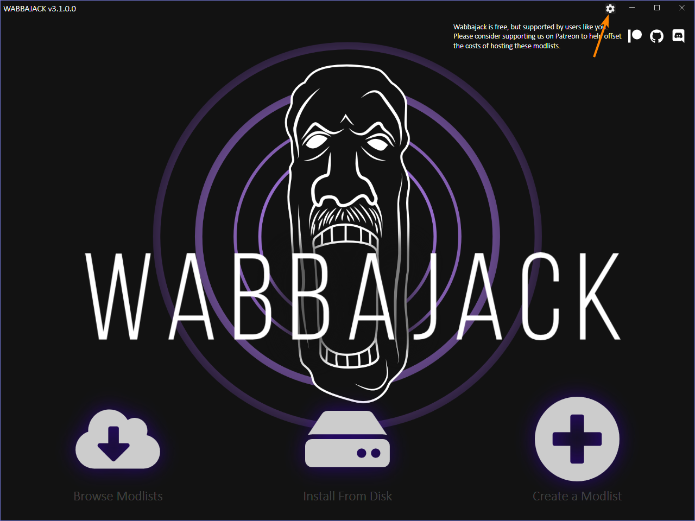
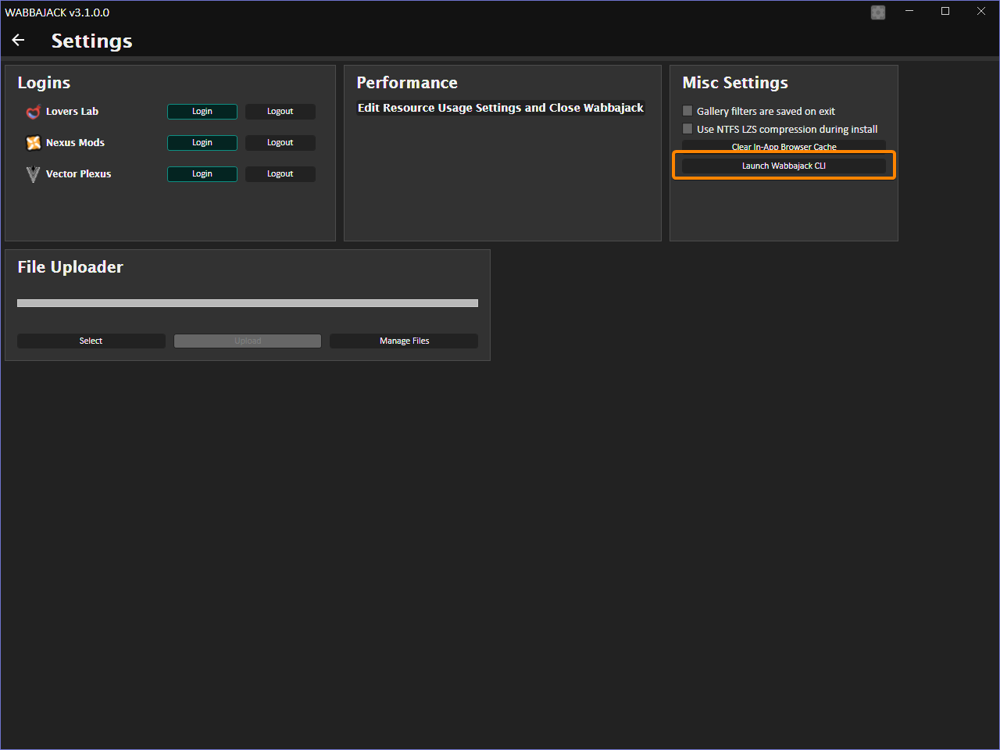

# Useful Things

## Verifying modlist install with Wabbajack
Sometimes modlists aren't perfectly installed - computers are fallible and there are many reasons as to why a modlist doesn't install 100% correctly *but* Wabbajack has a function built in to verify a modlist install. If you suspect that something isn't right with your install for whatever reason, you can run this to get Wabbajack to check.

So, how do we do this? First, start by opening Wabbajack and clicking the gear icon in the top right to open the settings page:

Once the settings page is open, click the `Launch Wabbajack CLI` button:

In the terminal window that opens, type in the following commands (make sure to edit it so that it points to your install paths!):

`cd ..`

Press Enter, then:

`.\wabbajack-cli.bat verify-modlist-install -m {path to your WJ folder}\3.2.0.0\downloaded_mod_lists\iAmModlist_@@_wod.wabbajack -i "{WoD install folder path}"`

Remember to remove the `{ }` brackets around the commands.
