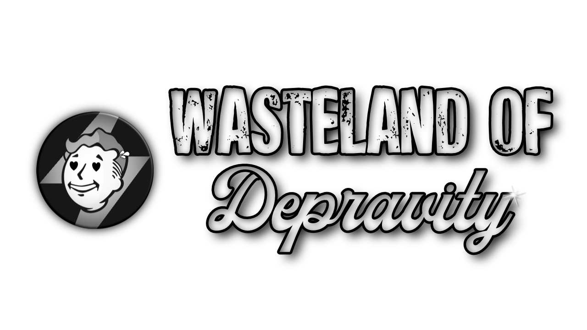

First things first: **this list contains adult content and you must be of legal age in your country. This means 18+ in most countries, 21+ in others. It is up to you to be sure of the age requirement in your country.**

*Support and general talk about Wasteland of Depravity resides on the Jolly Co-operators Discord:*

 &nbsp; 

# Quick Links
:computer:  **DLAA FOR NVIDIA RTX GPU USERS, [CLICK HERE](DLAA.md)**

:tv:  I have an Ultrawide monitor > [CLICK ME](Ultrawide.md)

:question: FAQ? > [FAQ!](FAQ.md)
  
:file_folder: Having issues with downloads in Wabbajack? [Check this page first.](https://github.com/iAmMe27/WoD/wiki)

# Getting Started

## Hardware Requirements

|             | CPU                             | RAM                 | GPU                                             |
|-------------|---------------------------------|---------------------|-------------------------------------------------|
| Minimum     | Intel 7th Gen,  AMD 3000 Series | 16GB DDR4 @ 3000MHz | RTX 2060, Radeon 5700 XT (at least 6GB of VRAM) |
| Recommended | Intel 9th Gen, AMD 5800X        | 32GB DDR4 @ 3600MHz | RTX 3070, Radeon 6800                           |

## Storage Space

|             | Total Space   | Storage Type        |
|-------------|---------------|---------------------|
| Minimum     | 400GB         | SATA SSD            |
| Recommended | 400GB         | NVMe SSD            |

## Accounts
In terms of accounts you will need:
  * Nexus Premium Account
  * LoversLab Account - *for manual downloads through your browser.*

## DLC
You will need *all* of the DLC for Fallout 4 ***except*** the official HD texture pack.

# Updating Wasteland of Depravity
Updates are basically the same as an installation except you have to ensure that you have the "Overwrite" checkbox ticked in Wabbajack.

> [!IMPORTANT]
> If you've added mods, you better know how to stop Wabbajack from removing them.

---

### [INSTALLATION](Installation.md) :arrow_forward:

